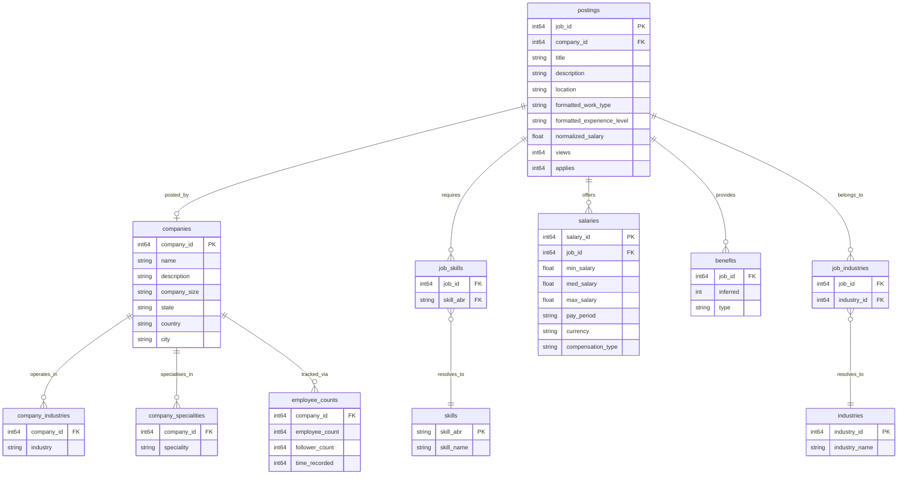

# Dataset Overview & Schema Documentation

This directory contains the LinkedIn Job Postings and associated metadata used in the `jobsrec` pipeline.

## 📊 Dataset Size Summary
*   **Total Local Dataset Size**: ~556.3 MB
*   **Upload Limitations**: Due to the 50 MB GitHub limit (and Git LFS requirements for large files), the main job postings file (`postings.csv`, **516.8 MB**) is git-ignored (`.gitignore`) and not pushed to remote. The other tables sum to **~39.5 MB** and are fully tracked in the repository.
*   **Sample Dataset**: A clean, fully-consistent subsample of 100 job postings is provided in [data/sample/](file:///C:/Users/Asus/Documents/code/vectorjobs/data/sample) (**373 KB** total) for testing and out-of-band/online agent analysis.

### Detailed File Sizes
| File / Directory | Tracked in Git? | File Size | Description |
| :--- | :---: | :---: | :--- |
| `postings.csv` | ❌ No (Ignored) | 516.8 MB | Main LinkedIn job postings table (100k+ rows) |
| `companies/companies.csv` | ✅ Yes | 23.2 MB | Detailed company profiles and descriptions |
| `companies/company_specialities.csv` | ✅ Yes | 4.43 MB | Mapping of companies to their core specialities |
| `jobs/job_skills.csv` | ✅ Yes | 3.51 MB | Job-to-skill mappings (abbreviations) |
| `jobs/job_industries.csv` | ✅ Yes | 2.51 MB | Job-to-industry mapping |
| `jobs/salaries.csv` | ✅ Yes | 2.25 MB | Compensation details per job |
| `jobs/benefits.csv` | ✅ Yes | 1.93 MB | Inferred/stated benefit types per job |
| `companies/employee_counts.csv` | ✅ Yes | 1.04 MB | Employee and follower count history |
| `companies/company_industries.csv` | ✅ Yes | 782 KB | Mapping of companies to industries |
| `mappings/industries.csv` | ✅ Yes | 12 KB | Industry ID to name mapping |
| `mappings/skills.csv` | ✅ Yes | 679 bytes | Skill abbreviation to human-readable name mapping |

---

## 📐 Data Relationships & Schema Shape

The tables are related via explicit key columns as illustrated below:

### Table Schema Definitions

#### 1. Core Postings (`postings.csv`)
*   `job_id` (int64, PK): Unique identifier for the job listing.
*   `company_id` (int64, FK): Maps to `companies.csv`. Nullable.
*   `title` (str): Title of the job posting.
*   `description` (str): Full Markdown/Plain-Text job description.
*   `normalized_salary` (float): Standardized annual salary value.
*   `views` / `applies` (int): User engagement metrics.

#### 2. Skills Mapping (`jobs/job_skills.csv` & `mappings/skills.csv`)
*   **Job Skills**: Associates jobs with skill codes (`job_id` ➔ `skill_abr`).
*   **Skills Mapping**: Translates 2-3 letter abbreviations to names (e.g., `IT` ➔ `Information Technology`, `ENG` ➔ `Engineering`).

#### 3. Salary Aggregation (`jobs/salaries.csv`)
*   Contains structured salary information. In the pipeline, multiple salary rows for a single `job_id` are collapsed using a deterministic aggregation rule (numeric fields take the max, string fields take the first non-null/non-empty value).

#### 4. Company Profiles (`companies/`)
*   **companies.csv**: Metadata about company headquarters, sizes, and names.
*   **company_industries.csv** & **company_specialities.csv**: Categorization tags.
*   **employee_counts.csv**: Historic snapshots of company size and follower counts.

---

## 🧪 Minimal Testing Subsample (`data/sample/`)
To allow remote/online agents or low-resource dev environments to inspect the dataset without cloning the massive 517 MB raw file, we provide a consistent **100-row sample** under `data/sample/`. 
This sample preserves all primary/foreign key mappings (containing 100 job postings, 68 unique companies, and all matching skill/industry mappings). It is fully committed to git and can be used as a test fixture.
